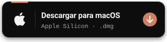
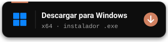
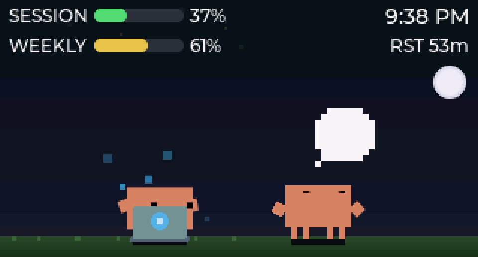
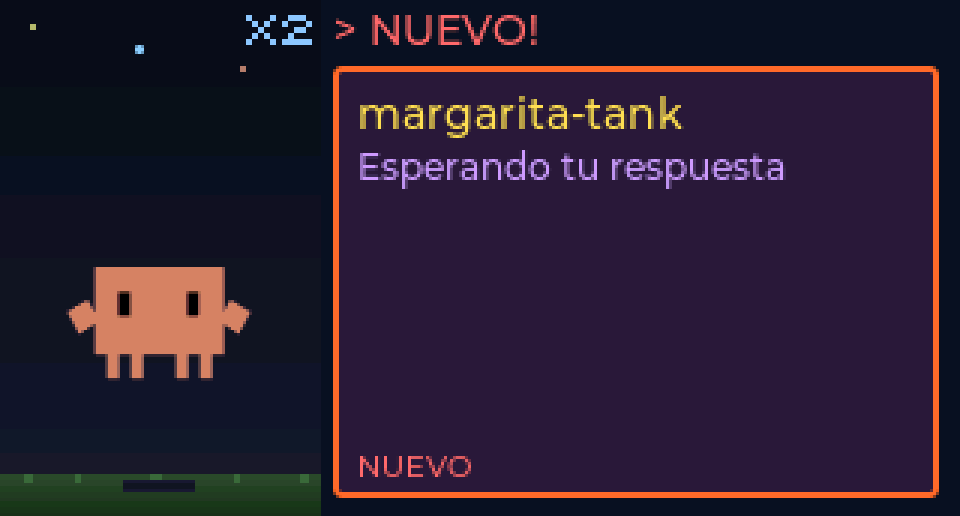
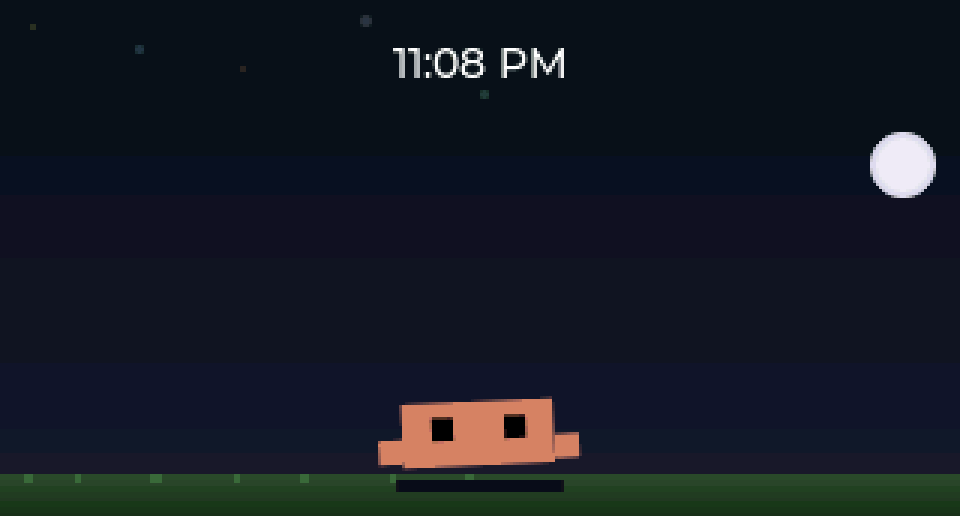
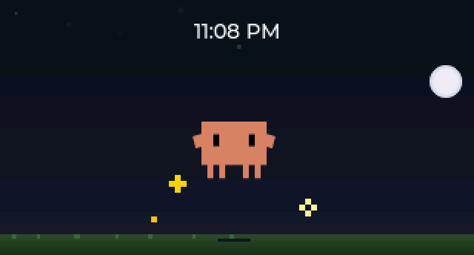
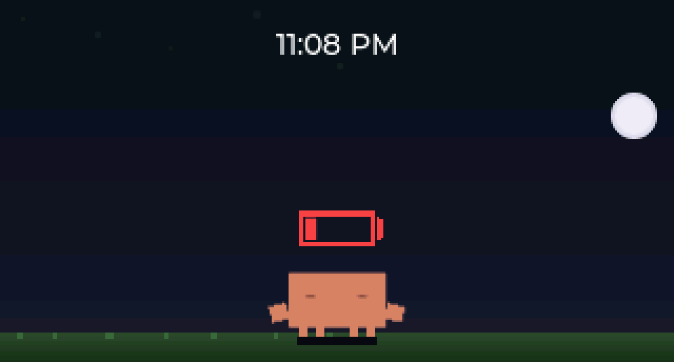
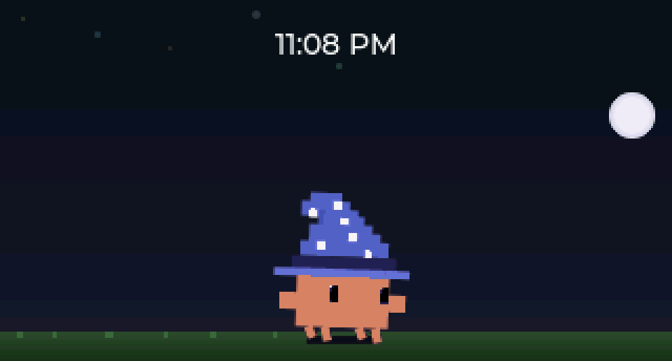

<picture>
  <source media="(prefers-color-scheme: dark)" srcset="assets/readme/banner-dark.svg">
  <source media="(prefers-color-scheme: light)" srcset="assets/readme/banner-light.svg">
  
</picture>

<p align="center">
<a href="https://github.com/sam-wilkie/margarita-tank/releases/latest"></a>
<a href="LICENSE"></a>
<a href="https://hits.sh/github.com/sam-wilkie/margarita-tank/"></a>
</p>

Un acuario de escritorio para tus sesiones de Claude Code. Un cangrejo pixel-art llamado Clawd vive en una pantalla y reacciona a lo que hace Claude: se anima según la herramienta en uso, avisa las notificaciones y ahora muestra tu **consumo de tokens en vivo** (sesión de 5 h y semanal) directamente en el display.

Corre sobre un [Waveshare ESP32-C6-LCD-1.47](https://s.click.aliexpress.com/e/_c4PGS55v) (320x172, ST7789). ¿Sin hardware? El simulador corre en macOS y Windows sin placa física.

> [!NOTE]
> **Nota de fork.** Este es un fork personal de [**Clawd Tank** de Marcio Granzotto Rodrigues](https://github.com/marciogranzotto/clawd-tank), bajo licencia MIT. Todo el crédito del firmware, el simulador y la arquitectura del daemon originales es del autor upstream. La portabilidad del simulador (macOS + Windows) también es del proyecto original.

## `$ ./descargar`

<p align="center">
<a href="https://github.com/sam-wilkie/margarita-tank/releases/latest/download/Margarita-Tank.dmg"><picture>
  <source media="(prefers-color-scheme: dark)" srcset="assets/readme/download-macos-dark.svg">
  <source media="(prefers-color-scheme: light)" srcset="assets/readme/download-macos-light.svg">
  
</picture></a>
<a href="https://github.com/sam-wilkie/margarita-tank/releases/latest/download/Margarita-Tank-Setup.exe"><picture>
  <source media="(prefers-color-scheme: dark)" srcset="assets/readme/download-windows-dark.svg">
  <source media="(prefers-color-scheme: light)" srcset="assets/readme/download-windows-light.svg">
  
</picture></a>
</p>

<p align="center"><sub>¿Buscas otra versión? <a href="https://github.com/sam-wilkie/margarita-tank/releases">Ver todas las releases</a></sub></p>

Ambos instaladores incluyen la app de la barra de menú / bandeja con el simulador integrado, y la app instala los hooks de Claude Code en el primer arranque. Después, reinicia tus sesiones de Claude Code.

<details>
<summary><b>Notas de instalación</b> (macOS, Windows y hardware)</summary>

<br>

- **macOS**: abre el DMG y arrastra **Margarita Tank** a Aplicaciones. La app está firmada ad-hoc pero no notarizada por Apple, así que la primera vez hay que hacer clic derecho → **Abrir** (o *Ajustes del Sistema → Privacidad y seguridad → Abrir igualmente*). Si macOS dice que la app "está dañada", ejecuta `xattr -dr com.apple.quarantine "/Applications/Margarita Tank.app"`.
- **Windows**: instalación por usuario, sin permisos de administrador. El instalador no está firmado, así que SmartScreen puede mostrar un aviso: haz clic en **Más información** → **Ejecutar de todas formas**. Al desinstalar se quitan de `~/.claude/settings.json` solo los hooks de Margarita Tank y, si lo activaste, la carpeta del panel de Claude Code; tus propios hooks quedan intactos.
- **Hardware**: el firmware del ESP32 no va en los instaladores; se flashea aparte (ver [Firmware](#firmware-esp-idf-53x)). Flashéalo de nuevo para ver las animaciones nuevas; con un firmware anterior la app sigue funcionando con las que ese firmware conoce. Sin hardware, usa el simulador incluido desde el menú de la app.
- **Bluetooth en PC de escritorio**: si la conexión se corta o falla con `Unreachable`, revisa que la placa tenga puestas las antenas Wi-Fi/Bluetooth. Sin ellas la señal llega muy débil (cerca de -95 dBm) aunque el ESP32 esté al lado.

</details>

## `$ ./margarita --preview`

<table>
<tr>
<td width="50%" valign="top">
<br>
<b>Varias sesiones + barra de uso</b><br>
Un Clawd por sesión, cada uno con su animación, y el consumo de tokens siempre visible arriba.<br>
<code>5 HORAS · SEMANA · ⟳ reinicio · reloj</code>
</td>
<td width="50%" valign="top">
<br>
<b>Notificaciones</b><br>
Cuando la API de Claude falla, aparece una tarjeta y el LED RGB parpadea. Que Claude termine su turno o te esté esperando lo muestra Clawd, sin tarjetas.<br>
<code>hasta 8 tarjetas · rotación automática</code>
</td>
</tr>
</table>

<sub>Capturas del simulador escaladas 3x. Los valores de uso son de demostración.</sub>

### Animaciones nuevas

<table>
<tr>
<td width="50%" valign="top">
<br>
<b>Despertar</b> · <code>wake</code><br>
Clawd se despierta cuando arranca una sesión mientras la pantalla dormía.
</td>
<td width="50%" valign="top">
<br>
<b>¡Listo!</b> · <code>happy</code><br>
Un salto de alegría cuando Claude termina su turno o cuando un subagente termina su trabajo.
</td>
</tr>
<tr>
<td width="50%" valign="top">
<br>
<b>Pila baja</b> · <code>low_battery</code><br>
Reemplaza al reposo cuando tu uso de Claude (5 h o semanal) llega al 90 %.
</td>
<td width="50%" valign="top">
<br>
<b>Sombrero caído</b> · <code>hat_mishap</code><br>
Cuando falla una búsqueda o descarga web (WebSearch / WebFetch).
</td>
</tr>
</table>

Mientras haces otra cosa, Clawd muestra lo que hace la sesión principal (pensar, escribir, construir…), y el contador del mini-cangrejo (<code>x1</code>, <code>x2</code>…) indica cuántos subagentes trabajan en segundo plano.

### Íconos

<p>

&nbsp;&nbsp;


</p>

Ícono de la app e instalador, y los tres estados de la bandeja de Windows: <b>gris</b> desconectado, <b>naranja</b> conectado y <b>punto rojo</b> con notificaciones. En macOS la barra de menú mantiene íconos monocromos que se adaptan al tema.

## `$ cat fork-changes.md`

Qué agrega este fork sobre Clawd Tank:

<table>
<tr>
<td width="50%" valign="top">
<b>Barra de uso</b><br>
Franja superior de dos filas con SESSION (5 h) y WEEKLY (7 d) como barras de progreso con color condicional (verde → lima → amarillo → naranja → rojo), cuenta regresiva de reset y reloj.<br>
<code>C · LVGL · firmware/main/scene.c</code>
</td>
<td width="50%" valign="top">
<b>Ciclo día/noche</b><br>
Amanecer cálido agregado a la transición de cielo.<br>
<code>C · LVGL · firmware/main/scene.c</code>
</td>
</tr>
<tr>
<td width="50%" valign="top">
<b>Rebrand "Margarita"</b><br>
Nombre BLE del dispositivo, scanner del daemon y tarjetas de notificación.<br>
<code>NimBLE · bleak · protocolo JSON</code>
</td>
<td width="50%" valign="top">
<b>Localización</b><br>
Textos de las tarjetas en español.<br>
<code>C · firmware/main/notification_ui.c</code>
</td>
</tr>
<tr>
<td width="50%" valign="top">
<b>Fix de watchdog</b><br>
Aísla los widgets de la barra del contenedor animado para frenar una tormenta de invalidaciones que hacía fallar al ESP32-C6.<br>
<code>C · LVGL · FreeRTOS</code>
</td>
<td width="50%" valign="top">
<b>Limpieza de sesiones</b><br>
Timeout adaptativo: las sesiones sin PID (p. ej., en Windows) se purgan más rápido para que no queden sesiones fantasma.<br>
<code>Python · asyncio · daemon</code>
</td>
</tr>
<tr>
<td width="50%" valign="top">
<b>Animaciones nuevas</b><br>
<code>wake</code>, <code>low_battery</code> y <code>hat_mishap</code> convertidas de los diseños SVG, y <code>happy</code> al terminar cada turno en lugar de la tarjeta "Esperando tu respuesta".<br>
<code>C · LVGL · sprites RLE · daemon</code>
</td>
<td width="50%" valign="top">
<b>Detección de firmware</b><br>
El firmware anuncia el protocolo v3; con un firmware anterior, el daemon traduce las animaciones nuevas a las que ya conoce, así que actualizar la app antes que el ESP32 no rompe nada.<br>
<code>NimBLE · GATT · daemon</code>
</td>
</tr>
<tr>
<td width="50%" valign="top">
<b>Conexión BLE robusta en Windows</b><br>
Un solo bucle de conexión por transporte, sin caché GATT de Windows, y límites de tiempo en el escaneo y la conexión para que el daemon no se cuelgue esperando a la pila Bluetooth.<br>
<code>Python · bleak · WinRT</code>
</td>
<td width="50%" valign="top">
<b>Íconos de Clawd</b><br>
El cangrejo como ícono de la app y del instalador, y en la bandeja de Windows con un color por estado.<br>
<code>tools/gen_app_icons.py</code>
</td>
</tr>
</table>

## `$ cat arquitectura.md`

```
Claude Code hooks --> clawd-tank-notify --> daemon --> BLE --> ESP32-C6 (Margarita)
                                                  \-> TCP --> Simulador (SDL2)
```

1. Los **hooks de Claude Code** (`SessionStart`, `PreToolUse`, `PreCompact`, `Stop`, `Notification`, `SessionEnd`, `SubagentStart/Stop`, etc.) se disparan con los eventos de sesión.
2. **clawd-tank-notify** reenvía el evento al daemon por un socket local.
3. El **daemon** (Python) sigue el estado de cada sesión, asigna animaciones según la herramienta, lee tu consumo del caché del statusline y envía payloads JSON a los transportes.
4. El **firmware** (o el simulador) renderiza la animación de Clawd, las notificaciones y la barra de uso en la pantalla.

## `$ cat stack.yaml`

```yaml
firmware:   C (ESP-IDF 5.3.x), LVGL 9.5, NimBLE
simulador:  C + SDL2 (macOS y Windows)
host:       Python >= 3.10 (asyncio, bleak para BLE)
hardware:   ESP32-C6, display ST7789 320x172
```

## `$ ./install --from-source`

### Firmware (ESP-IDF 5.3.x)

```bash
cd firmware
idf.py build
idf.py -p <PUERTO> flash monitor
```

En Windows el puerto es `COMx` (p. ej., `COM5`); en macOS/Linux, `/dev/ttyACM0` o similar.

### Simulador (sin hardware)

```bash
cd simulator
cmake -B build -G Ninja -DSTATIC_SDL2=ON -DCMAKE_C_COMPILER=gcc
cmake --build build
./build/clawd-tank-sim            # ventana interactiva
./build/clawd-tank-sim --listen   # escucha al daemon por TCP
```

### Daemon (host)

```bash
cd host
python -m venv .venv
.venv/bin/pip install -r requirements-dev.txt        # Windows: .venv\Scripts\pip
.venv/bin/python -m clawd_tank_daemon.daemon --sim   # con simulador
.venv/bin/python -m clawd_tank_daemon.daemon         # con BLE (busca "Margarita")
.venv/bin/python -m clawd_tank_menubar               # app de barra de menú / bandeja
```

## `$ ./configurar`

El daemon instala un hook handler en `~/.clawd-tank/clawd-tank-notify` (`clawd-tank-notify.py` en Windows). Para conectarlo a Claude Code, agrega los hooks a `~/.claude/settings.json` (o usa el instalador de la app). Reinicia las sesiones de Claude Code para que los cambios surtan efecto.

La app también conecta la barra de uso de tokens a través del `statusLine` de Claude Code: instala `~/.clawd-tank/statusline_bridge.py` (`margarita-statusline.exe` en el instalador de Windows) y lo registra como `statusLine` en `~/.claude/settings.json`. El puente guarda los límites de uso en `~/.clawd-tank/statusline-cache.json` y encadena tu `statusLine` anterior (guardado en `~/.clawd-tank/statusline-original.json`), así que tu línea de estado sigue funcionando igual. Al desinstalar los hooks se restaura tu `statusLine` original.

### Panel de Margarita dentro de Claude Code (opcional)

Margarita también puede vivir **dentro de Claude Code**: un panel lateral con el cangrejo animado y las barras de uso de 5 h y semanal, que sigue lo que hace tu sesión (pensando, escribiendo, esperando tu respuesta…). Es un mod de Claude Code (`claude-mod/margarita-band/`) y viene **desactivado**.

- **Activarlo o desactivarlo**: menú de la app → **Claude Code Mod (panel)**, junto a *Install Claude Code Hooks* (macOS y Windows). La marca indica que está activo.
- **Qué hace**: al activarlo copia el mod a `~/.clawd-tank/claude-mod/margarita-band/` y agrega esa carpeta a `env.CLAUDE_CODE_PLUGIN_DIRS` en `~/.claude/settings.json`; Claude Code carga cada carpeta de esa lista igual que `--plugin-dir` (varias carpetas se separan con `:` en macOS y `;` en Windows). Tus otras carpetas y el resto de tu configuración quedan intactos. Al desactivarlo se quita solo la carpeta de Margarita. Si `settings.json` no es un JSON válido, la app no lo toca y te avisa. Al desinstalar la app también se quita. Con el mod activo, la app actualiza los archivos copiados en cada arranque.
- **Reinicia tus sesiones de Claude Code** después de activarlo o desactivarlo: las sesiones abiertas no vuelven a leer esa lista.
- **Dónde aparece**: en pantalla completa el panel se acopla a la **derecha** desde unas **110 columnas** de ancho; en una terminal más angosta se muestra encima del prompt. `/margarita` lo abre de nuevo; `/margarita <animación>` previsualiza una animación y `/margarita auto` vuelve al modo automático.
- **Barras de uso**: las lee de `~/.clawd-tank/statusline-cache.json`, el mismo archivo que escribe el puente de `statusLine` de arriba.

Para renombrar el dispositivo, cambia el nombre en un solo lugar por capa:

| Capa | Archivo | Símbolo |
| ---- | ------- | ------- |
| Firmware | `firmware/main/ble_service.c` | `fields.name` / `ble_svc_gap_device_name_set` |
| Daemon | `host/clawd_tank_daemon/ble_client.py` | `DEVICE_NAME` |
| Tarjetas | `host/clawd_tank_daemon/protocol.py` | `DISPLAY_NAME` |

## `$ ./test`

```bash
# Tests del host (daemon + protocolo)
cd host && .venv/bin/python -m pytest -v   # Windows: .venv\Scripts\python -m pytest -v

# Tests C del firmware (notification store)
cd firmware/test && make test
```

## `$ cat CREDITS`

- Proyecto original: [Clawd Tank](https://github.com/marciogranzotto/clawd-tank), de Marcio Granzotto Rodrigues (MIT).
- Modificaciones de este fork: Sam Wilkie.

## `$ cat LICENSE`

MIT. Consulta [LICENSE](LICENSE): conserva el copyright original de Marcio Granzotto Rodrigues, además del de las modificaciones de este fork.
